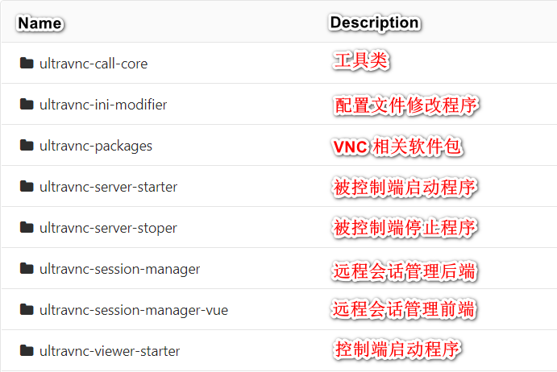

# ultravnc-call

[README](README.md) | [中文文档](README_zh.md)

&ensp;&ensp;&ensp;&ensp;UltraVNC 调用程序，仅适用于 windows（因为 UltraVNC 只有 windows 版本）。基于 UltraVNC Repeater 搭建中继服务器，使用本程序辅助调用 UltraVNC Server 和 Viewer ，实现复杂网络环境里的远程桌面功能。

&ensp;&ensp;&ensp;&ensp;2.0 版本对命令行参数做了修改，可以通过 -h 或 -help 来查看帮助。

## 1. 如何搭建中继服务器
&ensp;&ensp;&ensp;&ensp;请参考我的博文：
https://tudan.blog.csdn.net/article/details/100214799



<center>项目架构说明</center>
## 2. 服务说明

### 2.1 ultravnc-call-core 核心工具类

1. 注意配置文件 config.properties

```properties
# 项目开发模式（dev: 开发测试；其他都是发布版本，若发布，您可以使用 release，没有强制要求，阅读代码即可了解）
system.develop.mode=dev
```

### 2.2 配置文件 ultravnc-call.setting

请放到与 jar 包同级的目录下面，因为从“当前程序所在路径”获取的配置文件
```java
String settingPath = ClassUtils.getCurrentProgramPath() + "/ultravnc-call.setting";
```

### 2.3 ultravnc-server-starter（UltraVNCServer 启动器）

参数讲解：

1. 编号，唯一，必须是数字，且至少三位（即最小是 100，最大是 2147483647）

2. winvnc.exe 路径（可选参数）

3. 中继器服务器 IP（可选参数）

4. 中继器 UltraVNC Server 监听端口（可选参数）

```sh
# 中括号[]代表可选参数，若不填，则用配置文件中对应的默认值
java -jar ultravnc-server-starter-1.0.jar 90699 ["C:/Program Files/uvnc bvba/UltraVNC/winvnc.exe"] [10.20.16.48] [5500]
```

2.0 版本对命令行参数做了修改

```shell
# 中括号[]代表可选参数，若不填，则用配置文件中对应的默认值
java -jar ultravnc-server-starter-1.0.jar -id 90699 [-dir "C:/Program Files/uvnc bvba/UltraVNC/winvnc.exe"] [-ip 10.20.16.48] [-port 5500]
```

### 2.4 ultravnc-server-stoper（UltraVNCServer 停止器）

参数讲解：

1. 进程名称（可选参数）

```shell
# 中括号[]代表可选参数，若不填，则用配置文件中对应的默认值
java -jar ultravnc-server-stoper-1.0.jar [winvnc.exe]
```

2.0 版本对命令行参数做了修改

```shell
# 中括号[]代表可选参数，若不填，则用配置文件中对应的默认值
java -jar ultravnc-server-stoper-1.0.jar [-i winvnc.exe]
```

### 2.5 ultravnc-viewer-starter（UltraVNCViewer 启动器）

参数讲解：

1. 编号，唯一，必须是数字，且至少三位（即最小是 100，最大是 2147483647）

2. vncviewer.exe 路径（可选参数）

3. 中继器服务器 IP（可选参数）

4. 中继器 UltraVNC Viewer 监听端口（可选参数）

```shell
# 中括号[]代表可选参数，若不填，则用配置文件中对应的默认值
java -jar ultravnc-viewer-starter-1.0.jar 90699 ["C:/Program Files/uvnc bvba/UltraVNC/vncviewer.exe"] [10.20.16.48] [5901]
```

2.0 版本对命令行参数做了修改

```shell
# 中括号[]代表可选参数，若不填，则用配置文件中对应的默认值
java -jar ultravnc-viewer-starter-1.0.jar -id 90699 [-dir "C:/Program Files/uvnc bvba/UltraVNC/vncviewer.exe"] [-ip 10.20.16.48] [-port 5901]
```

### 2.6 ultravnc-ini-modifier（修改 UltraVNC 配置文件 ultravnc.ini）

&ensp;&ensp;&ensp;&ensp;要使 ultravnc.ini 生效，须安装系统服务，不建议这么做，使用前三个接口就可以搞定了。

参数讲解：

1. 编号，唯一，必须是数字，且至少三位（即最小是 100，最大是 2147483647）

2. ultravnc.ini 配置文件路径（可选参数）

```shell
# 中括号[]代表可选参数，若不填，则用配置文件中对应的默认值
java -jar ultravnc-ini-modifier-1.0.jar 90699 ["C:/Users/tudan/Desktop/ultravnc.ini"]
```

### 2.7 ultravnc-session-manager （会话管理程序）

1. 获取会话 id

   http(restful) 接口，get 方式

   ```http
   http://localhost:9081/usm/api/id
   ```

2. 释放会话 id

   http(restful) 接口，delete 方式
   
   ```http
   http://localhost:9081/usm/api/id?sessionId=1536406588
   ```